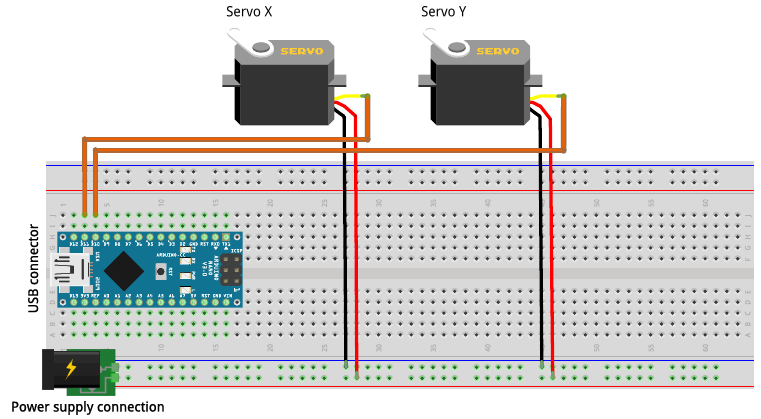
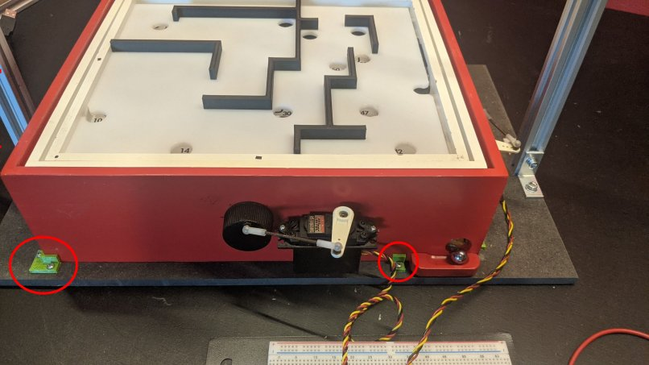

# Control Labyrinth Robot


## Project setup
To set up this project follow these steps:
1. Setup and activate `python3.10` virtual environment
2. Add package repository
    ```bash
    sudo add-apt-repository ppa:inivation-ppa/inivation
    sudo apt update
    ```
3. Install `libcaer-dev`
    ```bash
    sudo apt install libcaer-dev 
    ```
4. Install `opencv`
   ```bash
   sudo apt-get install python3-opencv
   ```
5. Install requirements
    ```bash
   pip install -r requirements.txt
    ```


## Running the project
To run the project flash the Arduino code `ServoControl/ServoControl.ino` to a Arduino Nano and wire the servos corresponding to this diagram:



The picture below shows which servo is which.

In `Controller.py` set the Arduino port on line 22.

Place the labyrinth against the mounting brackets.



To run the controller execute the following command:
```bash
python Controller.py
```
By default, the linear model predictive controller that is not aware of the walls in the labyrinth is executed.
An automatically generated path through the custom build labyrinth top is loaded from a file.
The labyrinth path can be changed by selecting a different path controllers in `Controller.py` on lines 54-56.
Different labyrinths work best with different control horizon and integral gain for the disturbance compensator, these can be changed in `Params.py` on line 70 and 78.

To achieve good results, it is helpful if the labyrinth platform is levelled.
The easiest way to level the labyrinth platform is to underlay on one side of the labyrinth until it is level.
Alternatively servo angles at which the platform should be level can be adjusted in `Params.py` on line 8-9.
Script `test/Servo-Test.py` can be used to find offset angles.

To run the non-linear simulation-based model predictive controller the C++ simulation must be compiled.
For this a cmake must be installed.
As the visualisation of the simulation is done with SFML, [SFML](https://www.sfml-dev.org/tutorials/2.6/start-linux.php) must be installed.
Please note that a powerful computer is required to run the non-linear simulation-based model predictive controller.
To compile the simulation, execute these commands:
```bash
cd simulation/PhysicSimulation
mkdir cmake-build-debug
cd cmake-build-debug
cmake ..
cmake --build . --target PhysicSimulationLib
```
Then in `Controller.py` on change the controller form `LinearMPC` to `SimulationController` by commenting line 59 and uncommenting line 60.
Finally, execute this command in the projects root directory to run the controller
```bash
python Controller.py
```

If the camera or camera position is changed, recalibration is required.
In addition, the image coordinates of the platform corner points must be adjusted in `Params.py` on lines 29-39.
In the event of major changes, the areas of the markers must also be adjusted in `Params.py` on line  44-48.

## Description of files:
All scripts are expected to be run from the project root directory.

- `analysis/*` collection of analysis tools
- `Calibration/*` Arduino code and python script to calculate ratios between servo and platform angles.
- `Controllers/Controllers.py` linear MPC implementation, non-linear MPC simulation integration
- `helpers/ArduinoRTTMeasurement/*` tools to measure Arduino serial communication RTT
- `HighLevelController/*` implementation of Strategic Planner with fixed path and auto path
- `Labyrinth/*` implementation of auto path finding through labyrinth based on image (threshold on line 88 of `LabyrinthDetection.py` must be adapted based on brightness)
- `Nets/*` [CueNet V2](https://github.com/FabianAmherd/Heatmap-based-Object-Detection-and-Tracking-with-a-Fully-Convolutional-Neural-Network) models and data recording, labeling and training scripts. 
- `ServoControl/ServoControl.ino` Arduino code to control the servos
- `simulation/SimulationInterface.py` interface for the C++ labyrinth simulation
- `simulation/PhysicSimulation` C++ labyrinth simulation
- `store/*` directory where data is stored, `index.csv` to keep track of stored data
- `test/LabyrinthDetectionTest.py` test for auto path finding, captures image with DAVIS camera and runs labyrinth detection and path finding (threshold on line 88 of `Labyrinth/LabyrinthDetection.py` must be adapted based on brightness)
- `test/PositionTracking.py` tool to test the ball position tracking in real time
- `test/Servo-Test.py` simple tool to set platform angles, base code taken from [here](https://github.com/SensorsINI/Zhuoyi-Liang-Labyrinth/blob/main/servo_test.py).
- `utils/*` different utility classes and functions
- `camera_params.pkl`/`camera_params_full.pkl` camera parameters from camera calibration
- `Controller.py` main program, uses strategy pattern to select path/controller implementation
- `CueNetV2.py` [CueNet V2](https://github.com/FabianAmherd/Heatmap-based-Object-Detection-and-Tracking-with-a-Fully-Convolutional-Neural-Network) model implementation
- `davis346_config.json` configuration for DAVIS camera
- `Davis346Reader.py` script to be run in different process to capture frames and send them to other process with a pipe
- `DisturbanceCompensator.py` implementation of the disturbance compensator.
- `MPC.py` implementation of the MPC model for the linear model predictive controller
- `Params.py` collection  of parameters for the controller
- `path-test.py` tool to plot paths against real time camera image
- `path*` collection of different paths
- `Plotter.py` script to plot controller state in real time
- `requirements.txt` packages required to run this project
- `ScoreMatrixGenerator.py` tool to generate score array used by simulation to evaluate control signals
- `StateDeviationPlot.py` state analysis tool

## Servo Control
0 point is located on the bottom left of the labyrinth.
#### X-Axis
- low pw moves board at 0 point up
- high pw moves board at 0 point down
#### Y-Axis
- low pw moves board at 0 point up
- high pw moves board at 0 point down
