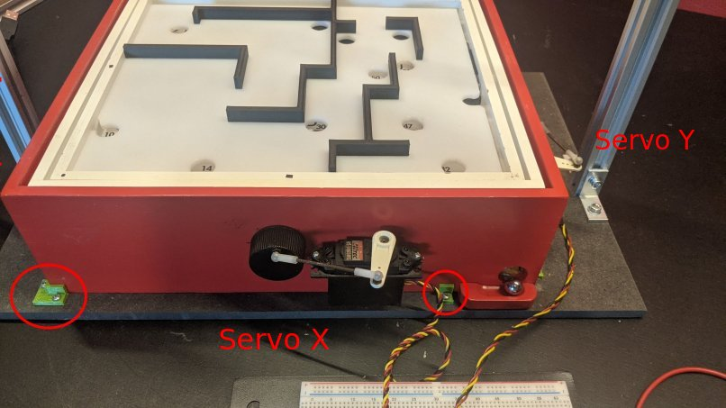

# Control Labyrinth Robot


## Project setup
To set up this project follow these steps:
1. Setup and activate `python3.10` virtual environment
2. Add package repository
    ```bash
    sudo add-apt-repository ppa:inivation-ppa/inivation
    sudo apt update
    ```
3. Install `libcaer-dev`
    ```bash
    sudo apt install libcaer-dev 
    ```
4. Install `opencv`
   ```bash
   sudo apt-get install python3-opencv
   ```
5. Install requirements
    ```bash
   pip install -r requirements.txt
    ```


## Running the project
To run the project flash the Arduino code `ServoControl/ServoControl.ino` to a Arduino Nano and wire the servos corresponding to this diagram:


In `Controller.py` set the Arduino port on line 22.

Place the labyrinth against the mounting brackets.



To run the controller execute the following command:
```bash
python Controller.py
```
By default, the linear model predictive controller that is not aware of the walls in the labyrinth is executed.
An automatically generated path through the custom build labyrinth top is loaded from a file.
The labyrinth path can be changed by selecting a different path controllers in `Controller.py` on lines 54-56.

To run the non-linear simulation-based model predictive controller the C++ simulation must be compiled.
For this a cmake must be installed.
As the visualisation of the simulation is done with SFML, [SFML](https://www.sfml-dev.org/tutorials/2.6/start-linux.php) must be installed.
Please note that a powerful computer is required to run the non-linear simulation-based model predictive controller.
To compile the simulation, execute these commands:
```bash
cd simulation/PhysicSimulation
mkdir cmake-build-debug
cd cmake-build-debug
cmake ..
cmake . --build --target PhysicSimulationLib
```
Then in `Controller.py` on change the controller form `LinearMPC` to `SimulationController` by commenting line 59 and uncommenting line 60.
Finally, execute this command in the projects root directory to run the controller
```bash
python Controller.py
```

## Servo Control
0 point is located on the bottom left of the labyrinth.
#### X-Axis
- low pw moves board at 0 point up
- high pw moves board at 0 point down
#### Y-Axis
- low pw moves board at 0 point up
- high pw moves board at 0 point down
